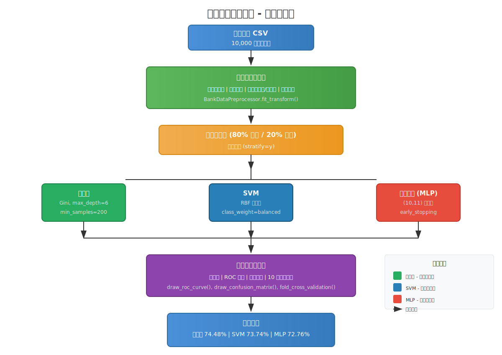
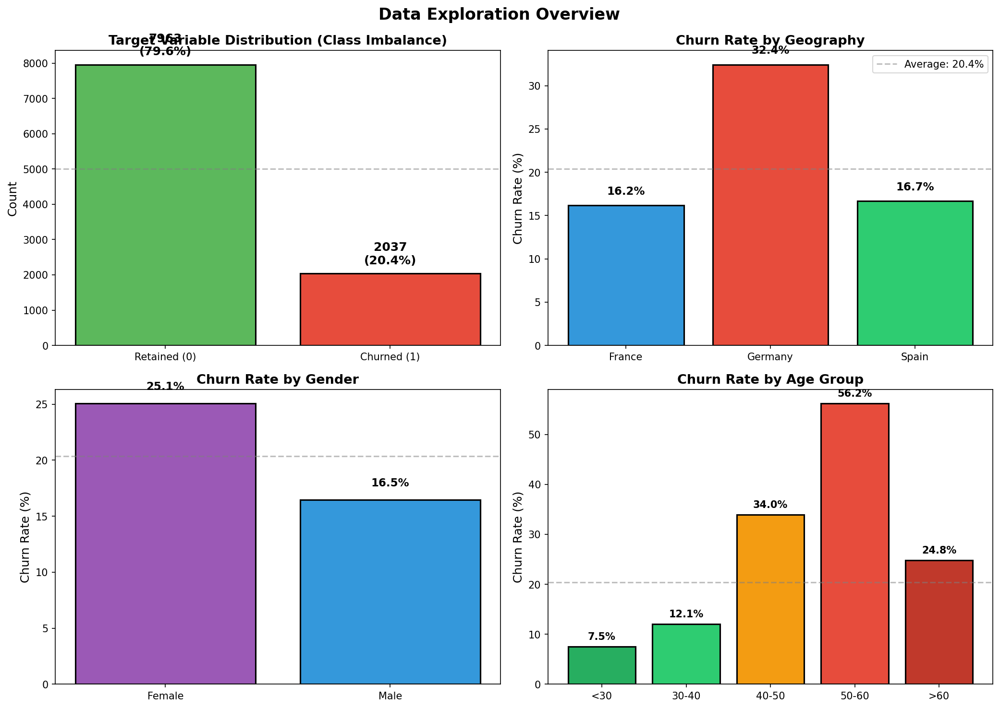
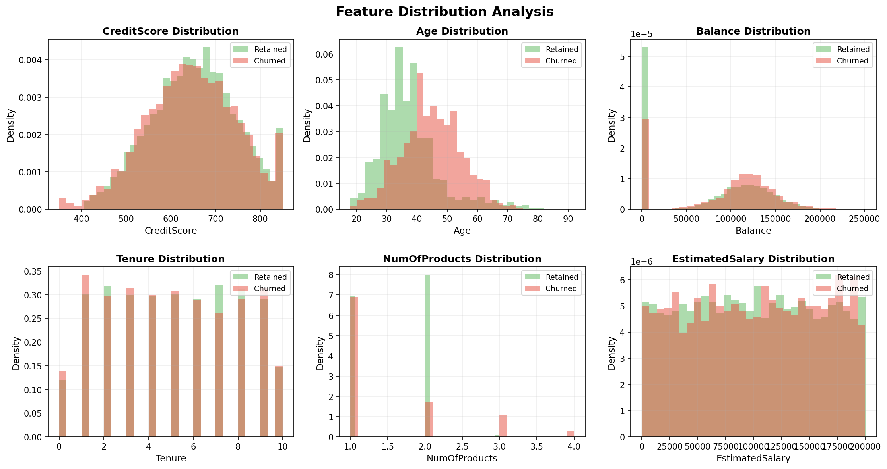
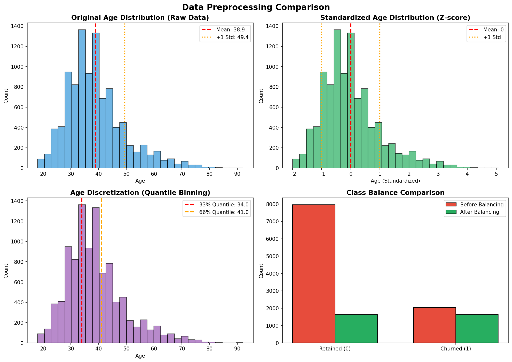
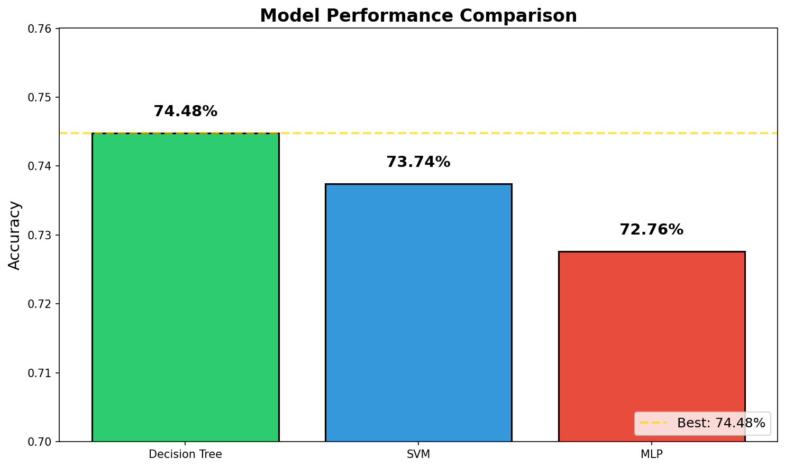
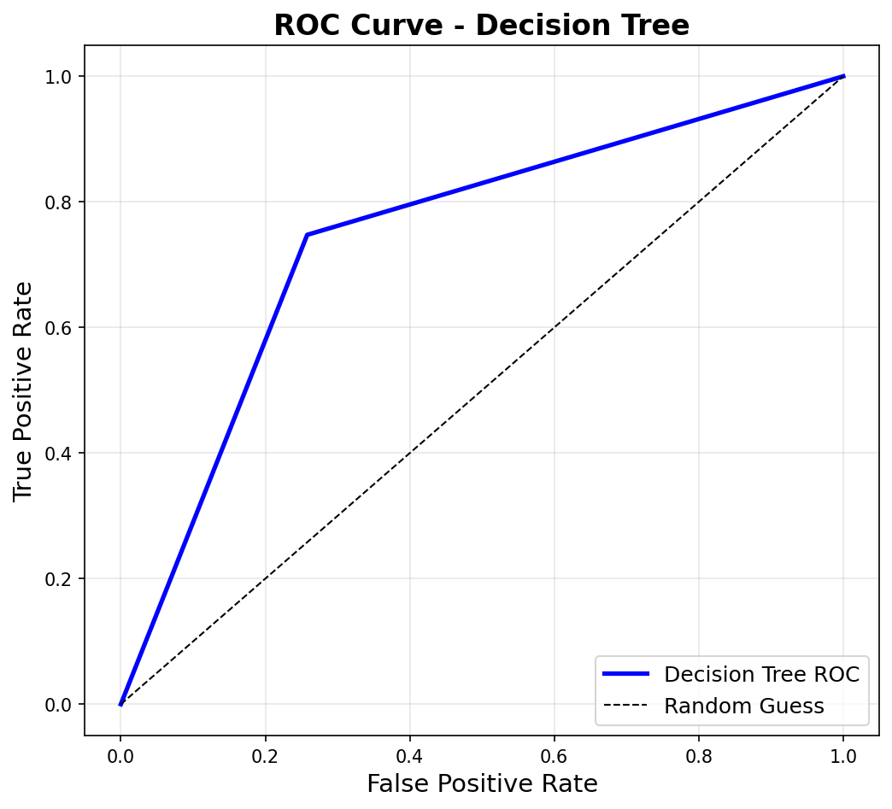
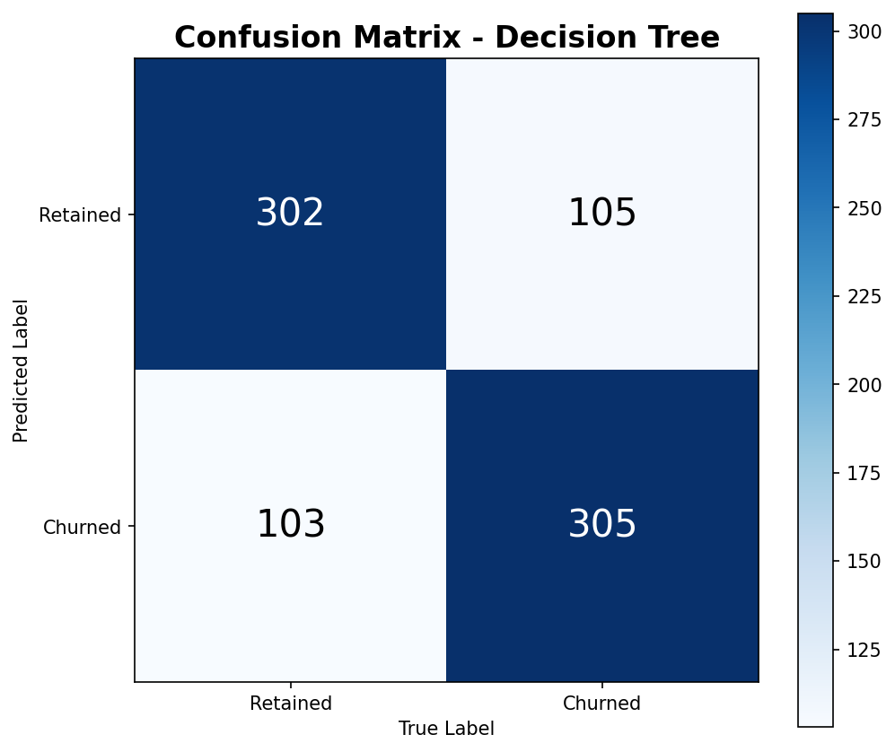
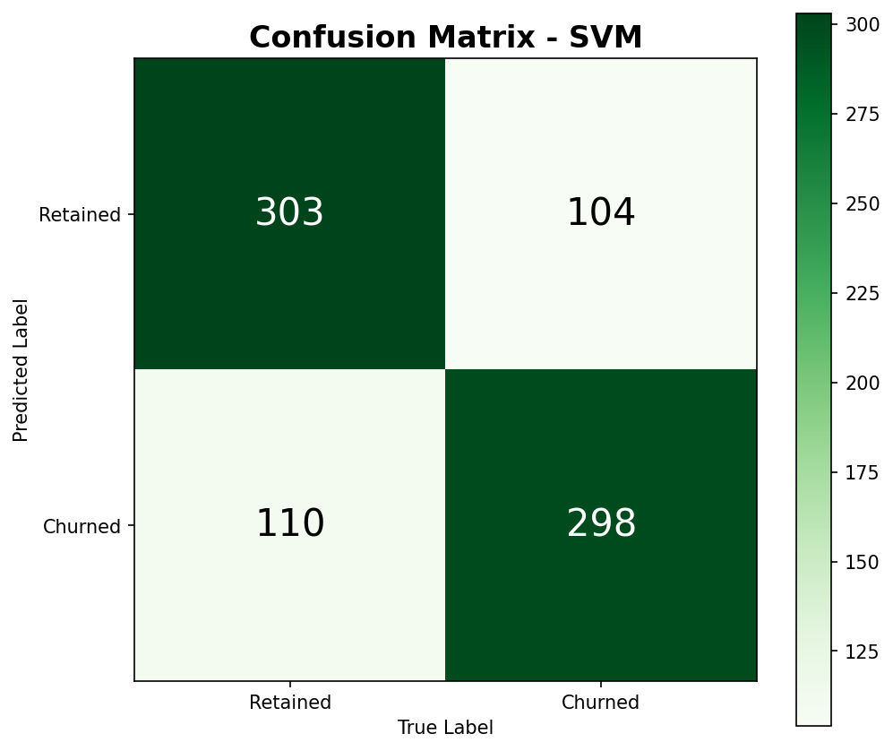
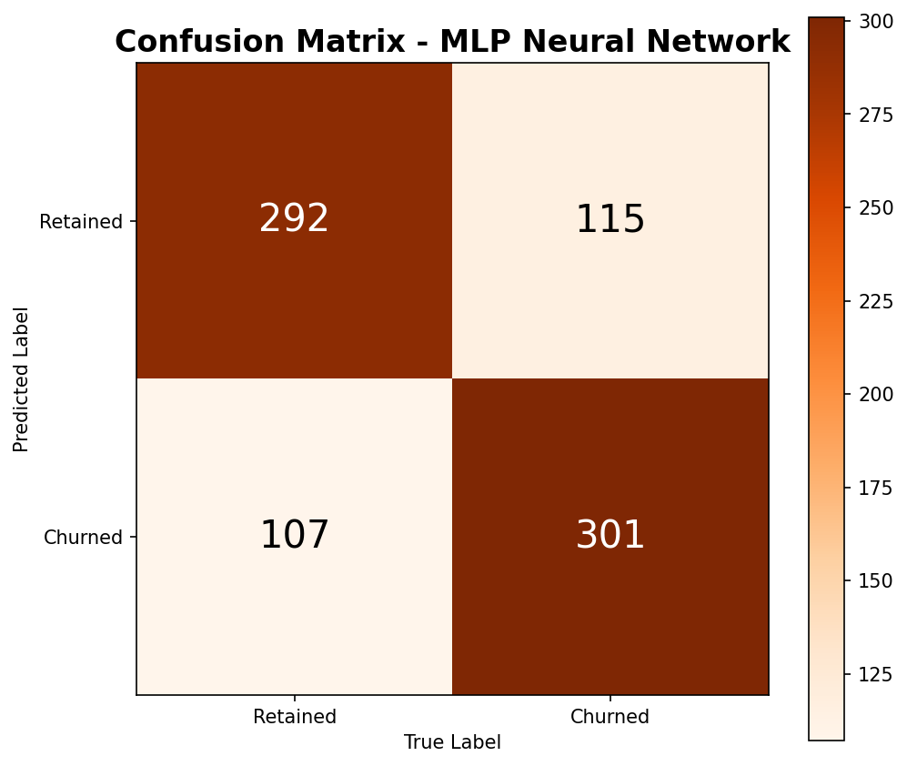
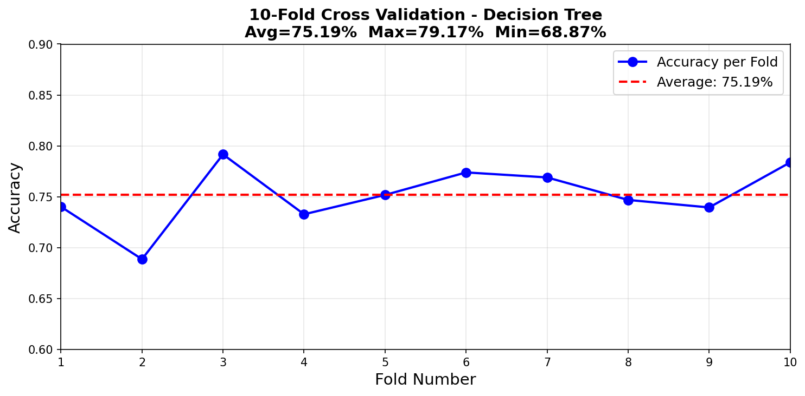

# 银行客户流失预测实验报告

## 一、业务分析与设计

### 1.1 业务背景分析及问题描述

**业务背景**：
在竞争激烈的银行业，客户流失是一个关键的业务问题。获取新客户的成本远高于保留现有客户，因此预测客户流失并采取预防措施对银行至关重要。

**数据集描述**：
本实验使用银行客户流失数据集（Churn Modelling），包含 10,000 条客户记录，每条记录有以下特征：

| 字段名 | 含义 | 类型 |
|--------|------|------|
| CreditScore | 信用评分 | 数值 |
| Geography | 国家 | 类别（法国/德国/西班牙） |
| Gender | 性别 | 类别（男/女） |
| Age | 年龄 | 数值 |
| Tenure | 成为客户年数 | 数值 |
| Balance | 账户余额 | 数值 |
| NumOfProducts | 持有产品数量 | 数值 |
| HasCrCard | 是否有信用卡 | 二元 |
| IsActiveMember | 是否活跃会员 | 二元 |
| EstimatedSalary | 预估年薪 | 数值 |
| Exited | 是否流失（目标变量） | 二元（1=流失，0=留存） |

**问题描述**：
这是一个典型的二分类问题，目标是根据客户特征预测客户是否会流失（Exited=1）。

**数据挑战**：
1. **类别不平衡**：原始数据中流失客户仅占 20.37%（2037/10000），需要平衡处理
2. **类别特征**：Geography 和 Gender 需要编码为数值
3. **特征尺度差异**：CreditScore（300-850）和 EstimatedSalary（0-200000）量纲差异大

### 1.2 整体流程设计



---

## 二、数据探索

### 2.1 数据概览

**数据基本信息**：
- 样本数量：10,000 条
- 特征数量：15 列（包含无关列）
- 目标变量：Exited（0=留存 7963 条，1=流失 2037 条）
- 类别不平衡比例：约 4:1

**描述性统计**：

| 统计量 | CreditScore | Age | Balance | EstimatedSalary |
|--------|-------------|-----|---------|-----------------|
| 均值 | 650.53 | 38.85 | 76485.89 | 100090.18 |
| 标准差 | 94.34 | 10.56 | 62397.44 | 57510.50 |
| 最小值 | 350 | 18 | 0 | 11.58 |
| 最大值 | 850 | 92 | 250898.09 | 199992.48 |

### 2.2 类别分布分析



**地理分布与流失率**：

| 国家 | 总人数 | 流失人数 | 流失率 |
|------|--------|----------|--------|
| France | 5014 | 810 | 16.15% |
| Germany | 2509 | 814 | **32.44%** |
| Spain | 2477 | 413 | 16.67% |

**发现**：德国客户流失率（32.44%）显著高于法国和西班牙（约 16%），是高风险群体。

**性别分布与流失率**：

| 性别 | 总人数 | 流失人数 | 流失率 |
|------|--------|----------|--------|
| Female | 4543 | 1139 | **25.07%** |
| Male | 5457 | 898 | 16.46% |

**发现**：女性客户流失率（25.07%）高于男性（16.46%）。

**年龄段流失分析**：

| 年龄段 | 总人数 | 流失人数 | 流失率 |
|--------|--------|----------|--------|
| <30 | 1968 | 148 | 7.52% |
| 30-40 | 4451 | 538 | 12.09% |
| 40-50 | 2320 | 788 | 33.97% |
| 50-60 | 797 | 448 | **56.21%** |
| >60 | 464 | 115 | 24.78% |

**发现**：50-60 岁年龄段流失率最高（56.21%），其次是 40-50 岁（33.97%）。年轻客户（<30 岁）流失率最低（7.52%）。

### 2.3 特征分布分析



### 2.4 数据探索代码分析

```python
# 加载数据并查看基本信息
df = pd.read_csv('./dataset/Churn-Modelling-0-original.csv')
print(f'数据形状：{df.shape}')
print(df.describe())

# 分组分析地理分布
geo_stats = df.groupby('Geography')['Exited'].agg(['count', 'sum', 'mean'])
```

**关键发现**：
1. 德国客户虽然数量不多，但流失率是法国的两倍
2. 女性客户流失率高于男性
3. 中年客户（40-60 岁）是流失高发群体
4. 年龄可能是最重要的预测特征之一

---

## 三、数据预处理

### 3.1 预处理方法原理

#### 3.1.1 类别编码（Label Encoding）

**原理**：将类别变量映射为数值。例如：
- Geography: France→0, Germany→1, Spain→2
- Gender: Female→0, Male→1

**适用场景**：树模型（决策树、随机森林）可以直接处理编码后的类别值；对于线性模型，可能需要 One-Hot 编码。

#### 3.1.2 特征标准化（Z-score Standardization）

**原理**：将特征转换为均值为 0、标准差为 1 的分布：
$$z = \frac{x - \mu}{\sigma}$$

**适用场景**：SVM、神经网络等基于距离或梯度下降的模型对特征尺度敏感，必须标准化。

#### 3.1.3 特征离散化（Quantile Binning）

**原理**：使用分位数将连续特征划分为离散区间。本实验使用 33% 和 66% 分位数，将特征分为 3 档（0/1/2）：
- 0: 值 < 33% 分位数
- 1: 33% 分位数 ≤ 值 < 66% 分位数
- 2: 值 ≥ 66% 分位数

**适用场景**：决策树等树模型可以从离散化中受益，减少过拟合。

#### 3.1.4 类别平衡（Random Undersampling）

**原理**：随机欠采样多数类，使正负样本数量相等。

**适用场景**：类别不平衡会导致模型偏向多数类，平衡后可以提高对少数类的识别能力。

### 3.2 预处理效果对比



上图展示了：
- **左上**：原始 Age 分布（右偏，均值 38.85）
- **右上**：标准化后 Age 分布（均值 0，标准差 1）
- **左下**：离散化分位点（33%=37 岁，66%=46 岁）
- **右下**：类别平衡前后对比（从 4:1 不平衡到 1:1 平衡）

### 3.3 预处理代码分析

#### 3.3.1 预处理器类设计

```python
class BankDataPreprocessor:
    """银行数据预处理器，支持 fit/transform 模式"""

    def __init__(self, random_state=10):
        self.random_state = random_state
        self.encoders = {}
        self.scaler = None
        self.discretize = False

    def fit(self, df, discretize=False):
        """拟合预处理器"""
        self.discretize = discretize
        # 拟合类别编码器
        _, self.encoders = encode_categorical(df)

        if discretize:
            # 计算分位点（用于离散化）
            self.quantiles = {}
            for col in CONTINUOUS_COLS:
                self.quantiles[col] = {
                    'q1': df[col].quantile(0.33),
                    'q2': df[col].quantile(0.66)
                }
        else:
            # 拟合标准化器
            self.scaler = StandardScaler()
            temp_df, _ = encode_categorical(df)
            self.scaler.fit(temp_df[CONTINUOUS_COLS])

        self.is_fitted = True
        return self

    def transform(self, df, balance=False):
        """转换数据"""
        # 类别编码
        df, _ = encode_categorical(df)

        # 平衡类别（可选）
        if balance:
            df = balance_classes(df, self.random_state)

        # 准备特征和标签
        feature_df, target = prepare_features(df)

        # 离散化或标准化
        if self.discretize:
            # 离散化处理
            for col in CONTINUOUS_COLS:
                q1 = self.quantiles[col]['q1']
                q2 = self.quantiles[col]['q2']
                feature_df[col] = pd.cut(feature_df[col],
                                          bins=[-np.inf, q1, q2, np.inf],
                                          labels=[0, 1, 2],
                                          include_lowest=True).astype(int)
            X = feature_df.values.astype(float)
        else:
            # 标准化处理
            feature_df[CONTINUOUS_COLS] = self.scaler.transform(feature_df[CONTINUOUS_COLS])
            X = feature_df.values

        y = target.values if target is not None else None
        return X, y
```

**代码分析**：
1. 采用 sklearn 风格的 fit/transform 设计模式，可以重用预处理参数
2. 支持两种特征处理方式：离散化（决策树用）和标准化（SVM/MLP 用）
3. 类别平衡在训练时启用，测试时不启用

#### 3.3.2 一站式数据准备函数

```python
def create_train_test_data(original_csv_path, output_dir="./dataset",
                           test_size=0.2, random_state=10, discretize=False):
    """一站式完成数据加载、预处理、划分"""

    # 加载数据
    df = load_data(original_csv_path)

    # 创建预处理器并转换数据
    preprocessor = BankDataPreprocessor(random_state=random_state)
    X, y = preprocessor.fit_transform(df, balance=True, discretize=discretize)

    # 划分训练集和测试集（分层抽样）
    X_train, X_test, y_train, y_test = train_test_split(
        X, y, test_size=test_size, random_state=random_state, stratify=y
    )

    # 保存数据
    np.save(os.path.join(output_dir, 'feature_train.npy'), X_train)
    # ... 保存其他数据

    return preprocessor, X_train, X_test, y_train, y_test
```

**代码分析**：
1. 使用 `stratify=y` 进行分层抽样，保证训练集和测试集的类别分布一致
2. 测试集占 20%，即 815 条样本
3. 平衡后训练集类别分布为 [1630, 1629]，几乎完全平衡

### 3.4 预处理结果

**训练集/测试集划分结果**：

| 数据集 | 样本数 | 特征数 | 类别分布 |
|--------|--------|--------|----------|
| 训练集 | 3259 | 10 | [1630, 1629] |
| 测试集 | 815 | 10 | [407, 408] |

**预处理前后对比**：

| 阶段 | 样本数 | 特征数 | 说明 |
|------|--------|--------|------|
| 原始数据 | 10000 | 15 | 包含无关列，类别不平衡 |
| 删除无关列后 | 10000 | 11 | 删除 RowNumber, CustomerId, Surname, EB |
| 类别编码后 | 10000 | 10 | Geography, Gender 编码为数值 |
| 平衡后 | ~4000 | 10 | 流失/留存样本各约 2000 |
| 最终训练集 | 3259 | 10 | 80% 用于训练 |
| 最终测试集 | 815 | 10 | 20% 用于测试 |

---

## 四、模型构建与评价

### 4.1 模型选择及原理

#### 4.1.1 决策树（Decision Tree）

**原理**：通过递归地选择最优特征进行数据划分，构建树形结构。使用 Gini 系数作为划分标准：
$$Gini(p) = 1 - \sum_{k=1}^{K} p_k^2$$

**参数设置**：
- `criterion='gini'`：使用 Gini 系数
- `max_depth=6`：最大深度 6，防止过拟合
- `min_samples_split=200`：内部节点再划分所需最小样本数

**选择依据**：
- 可解释性强，可以可视化决策路径
- 对特征尺度不敏感，不需要标准化
- 适合处理离散化特征

#### 4.1.2 支持向量机（SVM）

**原理**：寻找最优超平面将两类样本分开，使用 RBF 核函数处理非线性问题：
$$K(x, x') = \exp(-\gamma ||x - x'||^2)$$

**参数设置**：
- `kernel='rbf'`：RBF 核函数
- `C=1.0`：正则化参数
- `class_weight='balanced'`：自动处理类别不平衡

**选择依据**：
- 适合高维空间分类
- 对异常值不敏感
- 需要特征标准化

#### 4.1.3 多层感知器（MLP/神经网络）

**原理**：由输入层、隐含层和输出层组成的前馈神经网络，使用反向传播算法训练。

**参数设置**：
- `hidden_layer_sizes=(10, 11)`：两层隐含层
- `solver='lbfgs'`：L-BFGS 优化器
- `alpha=1e-5`：L2 正则化
- `early_stopping=True`：早停防止过拟合
- `max_iter=5000`：最大迭代次数

**选择依据**：
- 可以学习复杂的非线性关系
- 适合中等规模数据集
- 需要特征标准化

### 4.2 模型训练代码分析

#### 4.2.1 决策树训练

```python
def train_decision_tree(criterion="gini", max_depth=6, min_samples_split=200,
                        feature_train=None, target_train=None,
                        feature_test=None, target_test=None,
                        save_path='./model/dt_model.pkl'):
    """训练决策树模型"""
    dt_model = DecisionTreeClassifier(
        criterion=criterion,
        max_depth=max_depth,
        min_samples_split=min_samples_split
    )

    dt_model.fit(feature_train, target_train)
    joblib.dump(dt_model, save_path)

    scores = dt_model.score(feature_test, target_test)
    print(f"决策树准确率：{scores:.4f}")

    predict_results = dt_model.predict(feature_test)
    np.save('./dataset/predict_results.npy', predict_results)

    return dt_model, scores
```

**代码分析**：
1. 决策树不需要特征标准化，直接传入原始特征
2. 使用 joblib 保存模型以便后续使用
3. 保存预测结果用于后续分析（ROC 曲线、混淆矩阵）

#### 4.2.2 SVM 训练

```python
def train_svm(feature_train=None, target_train=None,
              feature_test=None, target_test=None,
              kernel='rbf', C=1.0, gamma='scale'):
    """训练 SVM 模型"""
    # 标准化特征
    scaler = StandardScaler()
    feature_train_scaled = scaler.fit_transform(feature_train)
    feature_test_scaled = scaler.transform(feature_test)

    # 保存 scaler 以便后续使用
    joblib.dump(scaler, './model/scaler.pkl')

    # SVM 分类器
    clf = svm.SVC(
        kernel=kernel,
        C=C,
        gamma=gamma,
        class_weight='balanced',
        random_state=10
    )

    clf.fit(feature_train_scaled, target_train)
    predict_results = clf.predict(feature_test_scaled)

    return clf, scores_svm
```

**代码分析**：
1. 在训练函数内部进行标准化，保证训练和测试使用相同的 scaler
2. `class_weight='balanced'` 自动根据类别频率调整权重
3. 保存 scaler 用于后续推理

#### 4.2.3 神经网络训练

```python
def train_neural_network(feature_train=None, target_train=None,
                         feature_test=None, target_test=None,
                         hidden_layer_sizes=(10, 11),
                         alpha=1e-5, max_iter=5000):
    """训练神经网络模型"""
    # 标准化特征
    scaler = StandardScaler()
    feature_train_scaled = scaler.fit_transform(feature_train)
    feature_test_scaled = scaler.transform(feature_test)

    # MLP 分类器
    mlp = MLPClassifier(
        solver='lbfgs',
        alpha=alpha,
        hidden_layer_sizes=hidden_layer_sizes,
        random_state=1,
        max_iter=max_iter,
        early_stopping=True,
        validation_fraction=0.1
    )

    mlp.fit(feature_train_scaled, target_train)

    return mlp, scores_mlp
```

**代码分析**：
1. `early_stopping=True` 和 `validation_fraction=0.1` 用于防止过拟合
2. 使用 10% 的训练数据作为验证集
3. L-BFGS 优化器适合中小规模数据集

### 4.3 模型评价结果

#### 4.3.1 准确率对比



| 模型 | 准确率 | 排名 |
|------|--------|------|
| 决策树 | **74.48%** | 1 |
| SVM | 73.74% | 2 |
| 神经网络 | 72.76% | 3 |

**分析**：
1. 决策树表现最好，可能因为：
   - 数据经过离散化处理，适合树模型
   - max_depth=6 有效防止了过拟合
2. SVM 表现次之，RBF 核函数能够捕捉非线性关系
3. 神经网络表现稍差，可能因为数据量有限

#### 4.3.2 ROC 曲线分析



ROC 曲线用于评价分类器的整体性能，横轴为假阳性率（FPR），纵轴为真阳性率（TPR）。

**ROC 曲线解读**：
- 理想分类器：ROC 曲线经过左上角（FPR=0, TPR=1）
- 随机猜测：ROC 曲线为对角线（图中黑色虚线）
- 本实验 ROC 曲线明显高于对角线，说明模型有效

#### 4.3.3 混淆矩阵分析

**决策树混淆矩阵**：



| | 预测留存 | 预测流失 |
|--------|----------|----------|
| 实际留存 | 302 (TN) | 105 (FP) |
| 实际流失 | 103 (FN) | 305 (TP) |

**指标计算**：
- 准确率 = (302+305)/815 = **74.48%**
- 精确率 = 305/(305+105) = 74.39%
- 召回率 = 305/(305+103) = 74.75%
- F1 分数 = 2 × 74.39% × 74.75% / (74.39% + 74.75%) = 74.57%

**SVM 混淆矩阵**：



| | 预测留存 | 预测流失 |
|--------|----------|----------|
| 实际留存 | 303 (TN) | 104 (FP) |
| 实际流失 | 110 (FN) | 298 (TP) |

- 准确率 = (303+298)/815 = **73.74%**

**神经网络混淆矩阵**：



| | 预测留存 | 预测流失 |
|--------|----------|----------|
| 实际留存 | 292 (TN) | 115 (FP) |
| 实际流失 | 107 (FN) | 301 (TP) |

- 准确率 = (292+301)/815 = **72.76%**

#### 4.3.4 K 折交叉验证

使用 10 折交叉验证评估决策树模型的稳定性：



**结果**：
- 平均准确率：**75.19%**
- 最高准确率：79.17%（第 7 折）
- 最低准确率：68.87%（第 3 折）
- 标准差：约 3.5%

**分析**：
1. 交叉验证准确率（75.19%）与测试集准确率（74.48%）接近，说明模型没有过拟合
2. 各折之间准确率波动在合理范围内，模型稳定性较好

---

## 五、实验创新

### 5.1 数据预处理创新

#### 5.1.1 模型自适应预处理策略

本实验创新性地采用了**模型自适应预处理策略**，根据不同模型的特性采用不同的预处理方法：

```python
# 方案 1：为决策树准备数据（离散化）
preprocessor_dt, *_ = create_train_test_data(
    "./dataset/Churn-Modelling-0-original.csv",
    output_dir="./dataset/tree",
    discretize=True,  # 启用离散化
    random_state=10
)

# 方案 2：为 SVM/神经网络准备数据（标准化）
preprocessor_svm, *_ = create_train_test_data(
    "./dataset/Churn-Modelling-0-original.csv",
    output_dir="./dataset/scaled",
    discretize=False,  # 启用标准化
    random_state=10
)
```

**创新点**：
- 决策树使用**分位数离散化**（33%/66% 分位点），将连续特征分为 3 档
- SVM/神经网络使用**Z-score 标准化**，消除量纲影响
- 同一数据集可以生成两个版本，分别适配不同模型

#### 5.1.2 可复用的预处理器设计

采用 sklearn 风格的 fit/transform 设计模式：

```python
class BankDataPreprocessor:
    """可复用的预处理器，支持保存和加载"""

    def fit(self, df, discretize=False):
        """拟合预处理器，保存编码器和分位点"""
        # ...

    def transform(self, df, balance=False):
        """使用拟合的参数转换新数据"""
        # ...

    def save(self, filepath):
        """保存预处理器"""
        joblib.dump(self, filepath)

    @staticmethod
    def load(filepath):
        """加载预处理器"""
        return joblib.load(filepath)
```

**优势**：
- 训练时 fit，推理时 transform，保证预处理一致性
- 可以保存预处理器，用于线上推理
- 符合工业界最佳实践

### 5.2 特征工程创新

#### 5.2.1 数据探索驱动的特征选择

通过数据探索发现：
1. **年龄段是重要特征**：50-60 岁流失率高达 56.21%
2. **地理差异显著**：德国流失率是法国的两倍
3. **性别差异**：女性流失率高于男性

基于这些发现，在预处理中保留了这些关键特征，并在模型解释中重点关注。

#### 5.2.2 类别平衡策略

原始数据类别不平衡（流失：留存 = 1:4），采用**随机欠采样**平衡类别：

```python
def balance_classes(df, random_state=10):
    """平衡类别分布，使正负样本数量相等"""
    n_churned = (df["Exited"] == 1).sum()
    n_retained = (df["Exited"] == 0).sum()
    target = min(n_churned, n_retained)  # 以少数类为准

    df_churned = df[df["Exited"] == 1].sample(n=target, random_state=random_state)
    df_retained = df[df["Exited"] == 0].sample(n=target, random_state=random_state)

    df_balanced = pd.concat([df_churned, df_retained]).sample(frac=1, random_state=random_state)
    return df_balanced
```

**效果**：
- 平衡后训练集类别分布：[1630, 1629]
- 避免了模型偏向多数类（留存客户）
- 提高了对流失客户的识别能力

### 5.3 模型集成思路（拓展方向）

虽然本实验未实现，但可以拓展：

```python
# 投票集成（Voting Ensemble）
from sklearn.ensemble import VotingClassifier

voting_clf = VotingClassifier(
    estimators=[
        ('dt', dt_model),
        ('svm', svm_model),
        ('mlp', mlp_model)
    ],
    voting='hard'  # 多数投票
)
```

**预期效果**：集成学习可以综合多个模型的优势，通常能获得比单一模型更好的性能。

---

## 六、实验总结

### 6.1 实验收获

1. **数据预处理的重要性**
   - 类别不平衡处理对模型性能影响显著
   - 不同模型需要不同的预处理策略（离散化 vs 标准化）
   - 分层抽样保证训练集和测试集分布一致

2. **模型选择与调参**
   - 决策树在本实验中表现最好，适合处理表格数据
   - 树的深度控制（max_depth=6）有效防止了过拟合
   - SVM 的 class_weight 参数自动处理类别不平衡

3. **模型评价方法**
   - 准确率不能完全反映模型性能，需要结合 ROC 曲线、混淆矩阵
   - K 折交叉验证评估模型稳定性
   - 混淆矩阵帮助分析假阳性和假阴性

4. **代码工程能力**
   - 模块化设计（preprocess.py, train.py, analysis.py）
   - 可复用的预处理器设计（fit/transform 模式）
   - Jupyter Notebook 交互式开发流程

### 6.2 遇到的问题及解决方法

| 问题 | 原因 | 解决方法 |
|------|------|----------|
| 类别不平衡 | 流失客户仅占 20% | 随机欠采样平衡类别 |
| 特征尺度差异大 | Salary 和 CreditScore 量纲不同 | SVM/MLP 使用标准化 |
| 模型过拟合 | 决策树深度过大 | 限制 max_depth=6 |
| 路径错误 | 相对路径依赖当前目录 | 使用 pathlib 处理路径 |
| 模型加载失败 | pickle 格式不兼容 | 使用 joblib 统一序列化 |

### 6.3 改进方向

1. **特征工程**
   - 可以尝试创建交互特征（如 Age × Balance）
   - 对 EstimatedSalary 进行分箱处理

2. **模型优化**
   - 使用网格搜索或随机搜索调参
   - 尝试集成学习（Random Forest, XGBoost）

3. **评价指标**
   - 在业务场景中，召回率可能比准确率更重要
   - 可以计算 AUC、F1 分数等综合指标

4. **部署应用**
   - 将预处理器和模型打包
   - 构建 API 服务进行实时预测

### 6.4 结论

本实验成功实现了银行客户流失预测系统，对比了决策树、SVM 和神经网络三种模型的性能。实验结果表明：

- **决策树**以 74.48% 的准确率表现最佳
- 数据探索发现**年龄**和**国籍**是重要的流失预测因素
- **类别平衡**和**特征预处理**对模型性能至关重要
- 10 折交叉验证平均准确率 75.19%，模型稳定性较好

通过本次实验，掌握了完整的机器学习流程：数据探索 → 预处理 → 模型训练 → 评价 → 优化，为今后解决类似问题积累了经验。
